# Artistic Style

Yet another implementation of [A Neural Algorithm of Artistic Style](https://arxiv.org/pdf/1508.06576v2.pdf) in TensorFlow.
Why? Because this thing blows me away each time I see it and after coding it from scratch it still blows me away!

## What is it?

This [paper](https://arxiv.org/pdf/1508.06576v2.pdf) explains how it is possible to extract the *style* and *content* from an image.
Extracting an artist's style from, say, a classic painting and combining it with the content of, say, a modern day photograph, we can envision what the artist would have painted.

For example, combining Edvard Munch's style from *The Scream* and the river from this photograph achieved this.

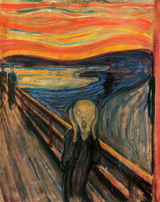

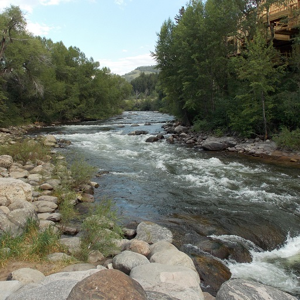
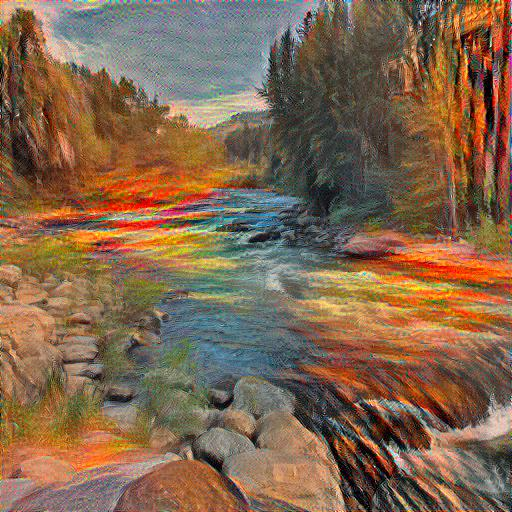

## Related projects

* [Justin Johnson's Torch implementation](https://github.com/jcjohnson/neural-style) - This one has some neat results
* [Anish Athalye's TensorFlow implementation](https://github.com/anishathalye/neural-style) - Probably the first implementation in TensorFlow - very similar to this one
* [Logan Engstrom's Fast Style Transfer](https://github.com/lengstrom/fast-style-transfer) - An implementation of [this paper](https://arxiv.org/pdf/1603.08155v1.pdf) in TensorFlow

There are many more similar projects out there.

## Dependencies

* Pre-trained VGG-19 Very Deep model can be downloaded from [here](http://www.vlfeat.org/matconvnet/pretrained/). Search for `VGG-VD` and download `imagenet-vgg-verydeep-19.mat`. Place this file inside a new directory called `data` in the root folder. Hence the model should be available at `./data/imagenet-vgg-verydeep-19.mat`. If you place it elsewhere make sure you pass in the respective optional argument while training.

* The program is designed to run on Python 3.6.x

* For additional modules that this program depends upon, run the following command to install all dependencies
```shell
$ pip install -r requirements.txt
```

## How to run?

After cloning, installing and dowloading [dependencies](#dependencies):

```shell
$ python main.py --content_img <content-img-path> --style_img <style-img-path> --output_img <destination-path>
```

There are various options that can be modified. Few of the important ones are:
* `--iterations <number>` - Changes the number of iterations backprop runs for. Defaults to 1000
* `--content_weight <number>` - Changes the weight of the content image (described as alpha in the paper). Defaults to 50
* `--style_weight <number>` - Changes the weight of the style image (described as beta in the paper). Defaults to 400
* `--learning_rate <number>` - Changes the learning rate of backprop. Defaults to 3

For the entire list of optional arguments, use this command:

```shell
$ python main.py --help
```

I've found that these default parameters work great in most cases, where are images are 512x512.
You might need to tune these hyperparameters for some images, especially with larger images.

**Note** The `--gpu` option does not work as expected currently.
So you may want to edit the source code directly until I fix that.
You can track this [issue](https://github.com/AparaV/artistic-style/issues/2) for progress on that front.

## Examples

### Different Styles

Here is the river picture again.


This time, I'm combining it *A Starry Night* (by Vincent Van Gogh), *Girl with a Mandolin* (by Pablo Picasso), and *The Great Wave off Kanagawa* (by Hokusai) respectively.

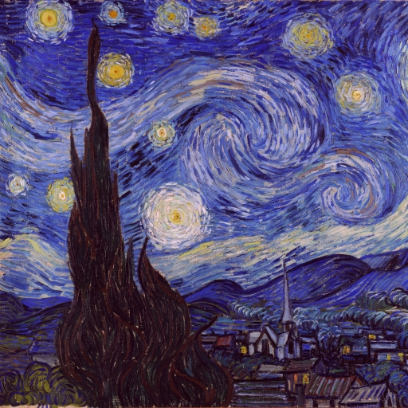
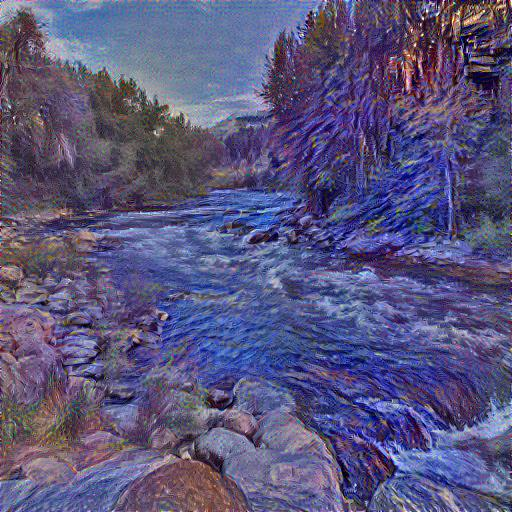

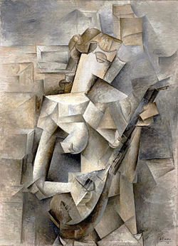
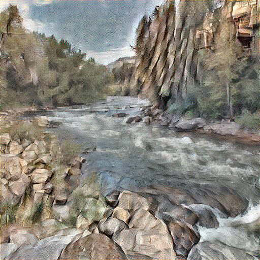

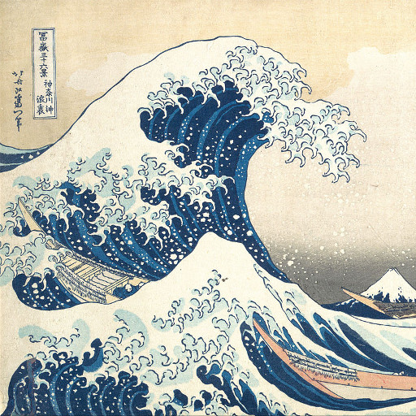
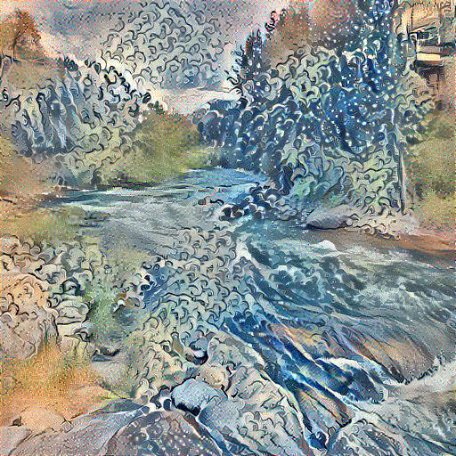

### Varying the number of iterations

Here is a picture of me. Let's look at how the image varies every 500 iterations from 500 to 2000 when combined with *A Starry Night*.

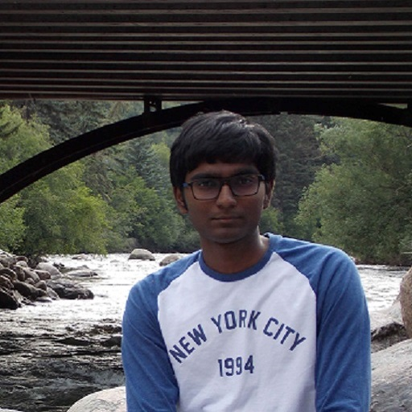


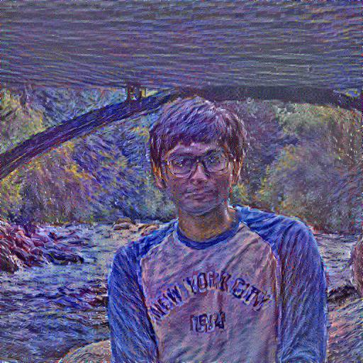
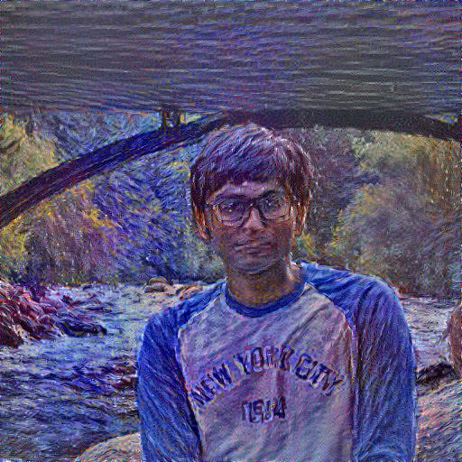
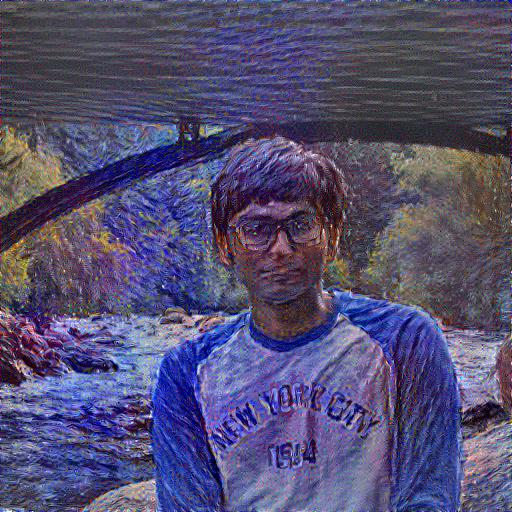
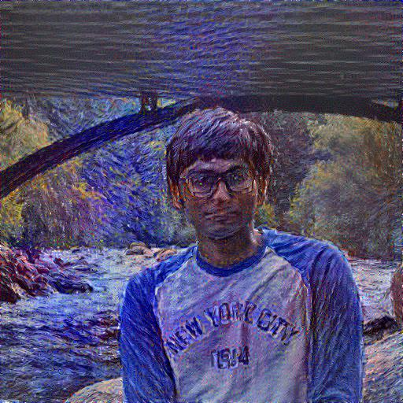

Top left - 500 iterations
Top right - 1000 iterations
Bottom left - 1500 iterations
Bottom right - 2000 iterations

I'd say 1000 - 1500 iterations should produce nice results given the other parameters are tuned properly.
But feel free to train longer if you have access to a GPU.
